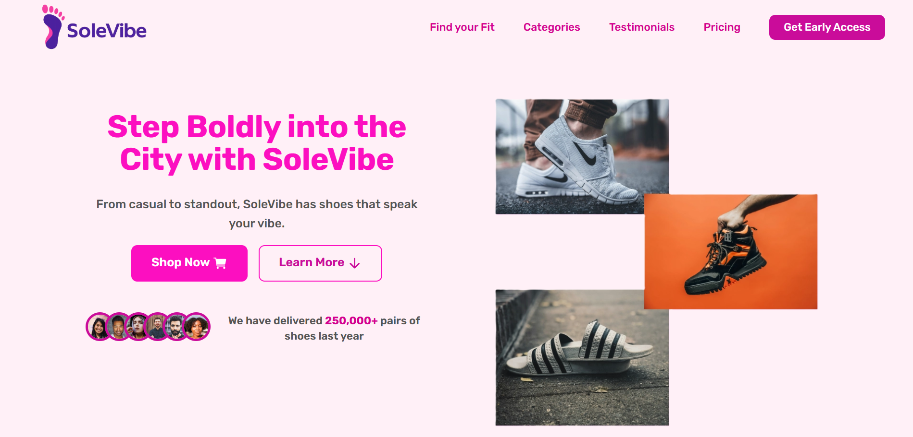
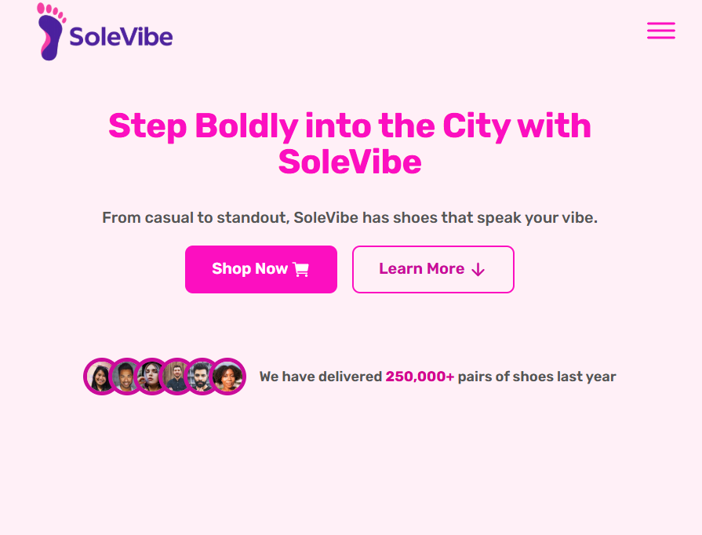
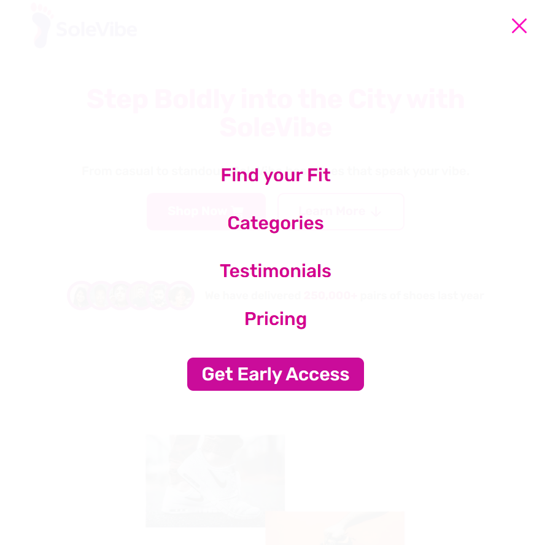

# 👟 SoleVibe | Modern Shoe Brand Showcase

A bold and responsive landing page for **SoleVibe**, a fictional contemporary shoe brand.  
Crafted using **HTML, CSS & JavaScript**, the site blends vibrant design, product presentation, and modern UI elements into an immersive user experience — all styled with a unique pink aesthetic and custom design system.

---

## 🎨 Features

- 📱 Fully responsive layout for desktop and mobile
- 🍔 Mobile hamburger menu with slide-in effect and toggle icons
- 🏷️ Product cards with hover effects and CTAs
- 💬 Testimonial section to build credibility
- 🎨 Custom design system (spacing, fonts, shadows)
- 🌈 Vibrant pink color theme (`#fc0fc0`)
- 💡 Ionicons for lightweight and stylish icons
- 🧼 Semantic, accessible, and maintainable code

---

## 🛠️ Built With

| Technology    | Purpose                         |
| ------------- | ------------------------------- |
| 🧱 HTML5      | Page structure                  |
| 🎨 CSS3       | Styling, layout, design system  |
| ✨ JavaScript | Mobile navigation interactivity |
| 🧩 Ionicons   | Icons for nav and UI feedback   |

---

## 📸 Screenshot

---

## 🌐 Live Demo

🌐 **Netlify Live Demo:**

Check out the live site here:

---

## 📧 Connect with Me 👟

🔗 **LinkedIn:**  
[https://www.linkedin.com/in/gaurav-lad1974](https://www.linkedin.com/in/gaurav-lad1974)

📨 **Email:**  
gauravlad1974@gmail.com
